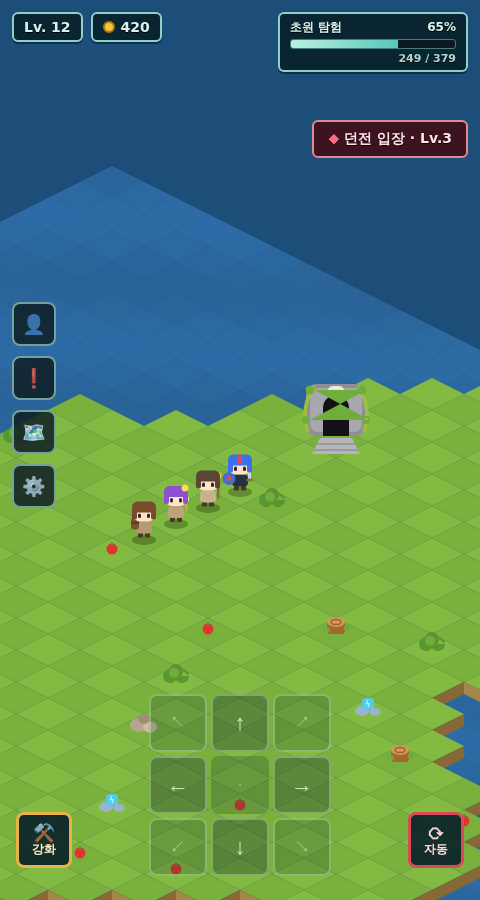
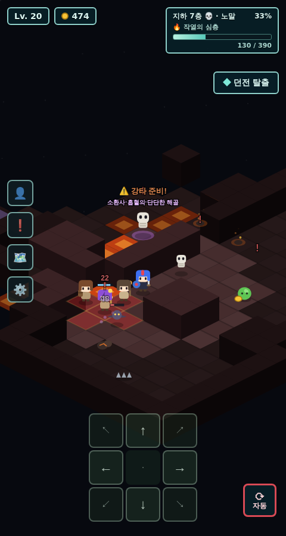
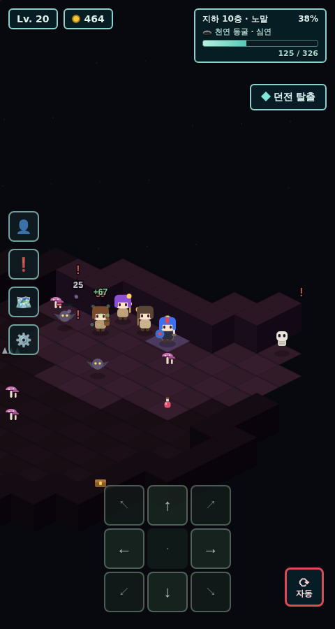
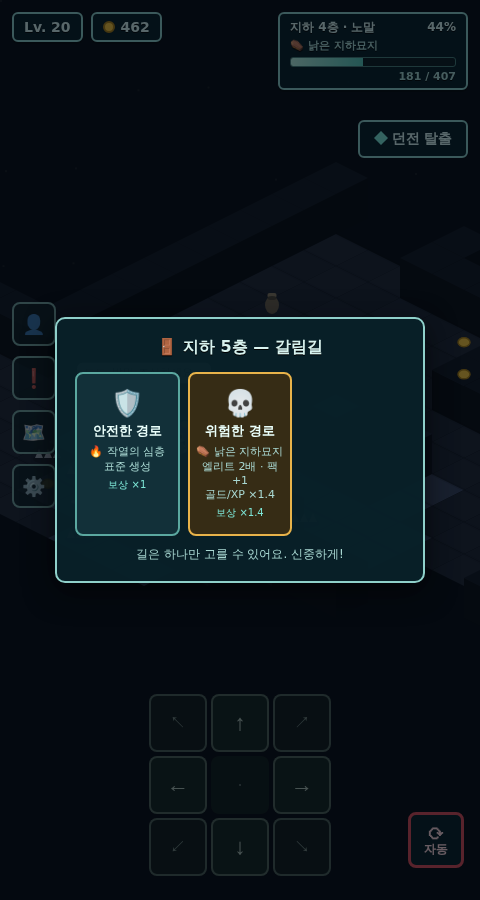
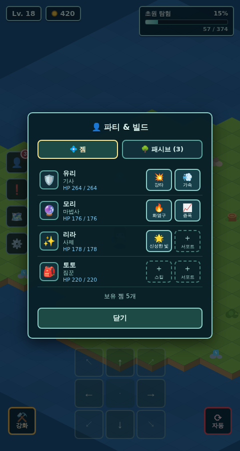
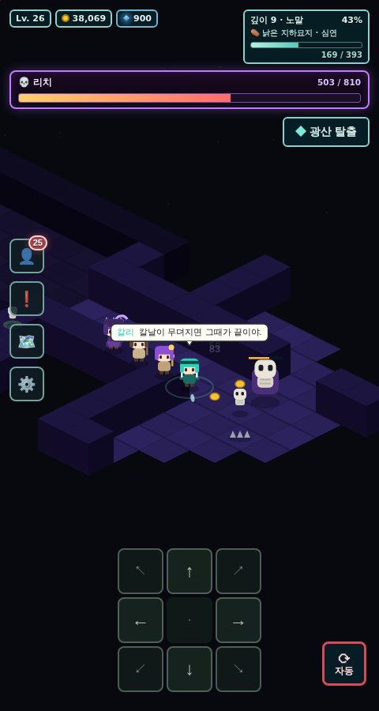

# 던전 (DunJeon) 🏰

귀여운 쿼터뷰(아이소메트릭) **로그라이트 파티 던전 크롤러**입니다.
초원을 탐험하다 해골 입구로 들어가면 절차 생성 던전이 펼쳐지고, 죽어도 골드·경험·빌드는 남아 다음 런이 수월해집니다.

**▶ 플레이: https://jh4334.github.io/dunjeon/** (main 브랜치 push 시 GitHub Pages로 자동 배포)

빌드 과정 없는 순수 HTML/CSS/JS(Canvas) 한 페이지입니다. 모바일에서는 하단 D-패드로 조작합니다.

| 초원 | 용암 바이옴 전투 | 심연 동굴 |
|---|---|---|
|  |  |  |

| 갈림길 | 파티 & 빌드 | 보스전 |
|---|---|---|
|  |  |  |

## 로그라이트 루프

1. **던전 입장** — 첫 입장 때 난이도를 고르고(이후 기억됨), 층마다 맵을 새로 생성합니다.
   **바이옴 4종**은 각자 다른 생성 알고리즘·몬스터 분포·장식을 씁니다.

   | 바이옴 | 생성 | 특징 |
   |---|---|---|
   | ⚰️ 낡은 지하묘지 | 방 + 복도 | 표준 구조 |
   | 🕳️ 천연 동굴 | 셀룰러 오토마타 | 유기적인 통로 · 박쥐 다수 |
   | 💧 물에 잠긴 수로 | 운하 + 다리 | 좁은 길목 · 슬라임 다수 |
   | 🔥 작열의 심층 | 용암 강 + 외길 다리 | 해골 다수 |

   **9층부터는 '심연'** — 어느 바이옴이든 팔레트가 어두운 보랏빛으로 물들고 층 이름에 `· 심연`이 붙습니다.

2. **계단을 밟으면 갈림길** — 다음 층을 2개 중 하나로 고릅니다 (보스 층은 갈림길 없이 고정 진입).
   - 🛡️ **안전한 경로**(보상 ×1) / 💀 **위험한 경로**(엘리트 2배 · 팩 +1, 골드/XP ×1.4)
   - 각 선택지는 25% 확률로 특수 층으로 바뀝니다 — 💰 **보물방**(몬스터 0, 보물 다수 + 함정 촘촘) / ⚔️ **도전방**(입구가 닫히는 3웨이브 아레나, 클리어 시 유물)
   - 일반 층 20% 확률로 🛒 **떠돌이 상인** — 골드로 유물·포션·젬 구매

3. **층마다 축복 선택** (런 한정, 3택1): 맹공 ⚔️ +15% 공격 / 강골 ❤️ +12% 체력 / 축복 ✨ +20% 치유 / 탐욕 💰 +20% 골드 / 급소 노리기 🎯 +8% 치명타 / 철벽 🛡️ -8% 피해

4. **3층마다 보스** (슬라임 킹 → 6층부터 리치) — 보스를 잡아야 계단이 열리고, 처치 시 **유물 3택1**
   - 유물 6종: 흡혈 송곳니 🗡️(피해 8% 흡혈) / 가시 갑옷 🌵(20% 반사) / 신속의 장화 👢(이동 +12%) / 황금 부적 🧿(골드 +30%) / 마나 수정 🔮(마법사 공속 +20%) / 불사조 깃털 🪶(전멸 1회 무효)

5. **층을 채우는 위협**
   - **엘리트**(보라 오라) — 어픽스 1~3개가 붙고 이름에 그대로 표시됩니다: 신속한 · 재생하는 · 폭발하는 · 소환사 · 흡혈의 · 단단한. 어픽스 1개당 보상 +60%
   - **팩 어그로** — 몬스터는 무리 단위로 배치되고, 한 마리가 깨면 무리 전체가 함께 달려듭니다
   - **텔레그래프 강타** — 엘리트/보스는 붉은 십자 장판으로 강타를 예고합니다. 1초 안에 피하세요. 맞아도 한 번에 최대 HP의 **45%까지만** 들어가므로 원샷은 없습니다
   - **샘 / 제단** — 회복 샘은 40% 확률로 💀 **저주받은 샘**이 되어 매복이 튀어나옵니다. 🎲 **도박 제단**은 골드(30×층)를 바쳐 50%로 축복 +1, 50%로 골드 소실 + 매복
   - 가시 함정, 회복 포션, 보물상자

6. **전멸하면** 축복·유물은 사라지고 골드 일부(난이도별 10~25%)를 잃지만, 레벨·경험치·젬·장비·패시브·캐릭터·영구 강화는 남습니다.

7. **초원의 ⚒️ 모닥불 캠프**에서 골드로 영구 강화 — 최고 도달 층 🏆도 기록됩니다.

## 빌드 시스템

### 🎭 캐릭터 22종 · 파티 편성

캠프(⚒️ 강화 → 🎭 파티 편성)에서 **4명을 골라 편성**하고 **리더(0번 자리)** 를 지정합니다.
편성은 **던전 밖(초원)에서만** 바꿀 수 있습니다. 기본 4인은 처음부터 보유, 나머지는
**골드 / ◆ 아주라이트 / 최고 깊이** 조건으로 해금합니다(진열에 조건이 표시됩니다).

장비·젬·기록은 **자리(슬롯)가 아니라 캐릭터**에 붙습니다 — 파티에서 빼도 그대로 남습니다.

| 분류 | 캐릭터 | 해금 | 고유 능력 |
|---|---|---|---|
| ⚔️ 근접 | 🛡️ 유리 | 기본 | 수호 강타 — 때린 적의 **인접 1체에 50% 스플래시** |
| ⚔️ 근접 | 🗡️ 칼리 | 800 G | 회전 칼날 — 0.5초마다 주변 8칸에 공격력 65% (근접 공격 없음) |
| ⚔️ 근접 | 🔱 라온 | 600 G | 관통 찌르기 — **직선 2칸 관통**(뒤 대상 70%) |
| ⚔️ 근접 | 👊 하루 | 700 G | 연타·흘리기 — **2연타**(2타 60%) · **회피 15%** |
| ⚔️ 근접 | 🪃 도르 | 1,000 G · 깊이 5 | 반달 베기 — 느린 대신 **대상 주변 1칸 광역**(부가 70%) |
| ⚔️ 근접 | 🪓 그림 | 1,050 G · 깊이 6 | 광폭화 — **HP가 낮을수록 공격력 최대 +80%** |
| ⚔️ 근접 | ⚜️ 세이나 | 1,400 G · ◆70 · 깊이 10 | 수호의 서약 — **피격 시 주변 아군에게 실드**(쿨 4초) |
| 🏹 원거리 | 🔮 모리 | 기본 | 원소 시전 — 3.5칸 원거리 · 마법 스킬 젬 전담 |
| 🏹 원거리 | 💣 봄이 | 500 G | 지뢰·투척 — 지나온 칸에 지뢰(최대 8) + 3.5칸 폭탄 |
| 🏹 원거리 | 🏹 시온 | 750 G | 관통 화살 — **직선 3.5칸 관통**(뒤 대상 70%) |
| 🏹 원거리 | 🔥 비단 | 900 G · 깊이 4 | 화염 장판 — 착탄 지점에 **3초 화상 도트** |
| 🏹 원거리 | ❄️ 서리 | 950 G · ◆30 | 한기 — **공격마다 슬로우** · 20% 빙결 |
| 🏹 원거리 | 🌀 미르 | 1,250 G · ◆55 · 깊이 8 | 추적 정령 — **자동 추적 정령 1기** |
| ✨ 지원 | ✨ 리라 | 기본 | 치유의 기도 — 가장 다친 아군 회복(신성한 빛 젬 = 광역) |
| ✨ 지원 | 🎒 토토 | 기본 | 보물 감각 — **미니맵에 상자·장비 표시** |
| ✨ 지원 | 💀 느와르 | 300 G | 해골 소환 — 6초마다 해골(최대 3) · 근접 40% |
| ✨ 지원 | 🎵 루체 | 800 G · 깊이 3 | 행진곡 — **파티 전원 공격/시전 쿨 -15%** 오라 |
| ✨ 지원 | 🎐 아야메 | 1,200 G · 깊이 7 | 결계 부적 — **8초마다 파티 전원 실드** |
| ✨ 지원 | ⚗️ 포포 | 1,150 G · ◆45 | 회복병 — **포션 효과 2배** + 7초마다 파티 회복 |
| ✨ 지원 | ⏳ 세라 | 1,500 G · ◆80 · 깊이 12 | 지연장 — **주변 3칸의 적 상시 감속** |
| ✨ 지원 | 🐻 나무 | 1,300 G · ◆60 | 곰 변신 — 전투 중 **근접 피해 2배 · 체력 +30%** |
| ✨ 지원 | 🐺 카야 | 1,100 G · ◆40 | 늑대 동료 — **늑대 펫 1마리**가 함께 싸운다 |

- **역할 태그**(근접/원거리/마법/치유/지원/방어/소환)로 젬 장착이 결정됩니다 —
  마법 젬은 마법 태그, 강타·맹독은 근접 태그, 신성한 빛은 치유 태그를 가진 캐릭터에게만 들어갑니다.
- **사제가 없는 파티도 성립**합니다. 치유 태그 보유자가 쓰러진 동료를 일으키고,
  아무도 없으면 자력으로 **기본 시간의 2배**에 걸쳐 부활합니다.
- **실드**는 받는 피해를 먼저 흡수하는 새 상태입니다(세이나·아야메·트리 노드).
- 성격은 **씩씩 / 시크 / 다정 / 너스레** 4군으로 나뉘어 공용 대사 풀을 쓰고,
  캐릭터마다 **전용 대사 3줄 이상**을 따로 갖습니다.

### 🗡️ 장비 — 슬롯 · 레어리티 · 접사 · 고유 (M2)

파티원 4명이 각각 **무기 🗡️ / 방어구 🛡️ / 장신구 💍** 3슬롯을 갖습니다.
몬스터·상자·광맥·상인에게서 떨어지며 **런이 끝나도 영구 소장**됩니다(가방 40칸).
👤 버튼 → `🗡️ 장비` 탭에서 장착·해제·판매합니다.

| 레어리티 | 색 | 접사 | 이름 |
|---|---|---|---|
| 일반 | 흰 | 0개 | 베이스 그대로 (`검`) |
| 마법 | 파랑 | 1~2개 | 접두 + 베이스 (`사나운 단검`) |
| 희귀 | 노랑 | 3~4개 | 2어절 고유 이름 + 베이스 (`황혼의 송곳니 (검)`) |
| 고유 | 주황 | 고정 효과 | `「망자의 서약」` |

- **베이스 9종** — 무기: 단검/검/지팡이 · 방어구: 로브/사슬 갑옷/판금 갑옷 · 장신구: 반지/부적/허리띠.
  역할 제한 없이 누구나 낄 수 있고 **수치 배율만** 다릅니다(0.85 / 1.0 / 1.15).
- **접사 16종** (값은 드랍 깊이 = `ilvl` 로 스케일) — 공격력 % · 최대 체력 % · 치명타 확률 · 치명타 피해 % ·
  공격 속도 % · 이동 속도 % · 골드 획득 % · 아주라이트 획득 % · 흡혈 % · 피해 감소 % · 시야 ·
  치유량 % · 텔레그래프 피해 감소 % · 어둠 저항 % · 스킬 젬 효과 % · 부활 속도 %.
  골드/아주라이트/시야/어둠 저항/부활은 **파티 전원 합산**, 이동 속도는 리더 장비, 나머지는 착용자 본인에게 적용됩니다.
  (피해 감소 60% / 텔레그래프 70% / 어둠 저항 80% / 흡혈 25% 상한)
- **고유 7종** — 빌드를 바꾸는 고정 효과. 미니언/지뢰/오라를 건드리는 3종은 **리더가 착용해야** 발동합니다.

| 고유 | 슬롯 | 효과 |
|---|---|---|
| 💀 「망자의 서약」 | 무기 | 해골 미니언 최대 **+2**(리더) · 착용자 공격력 **-30%** |
| 🎆 「폭죽 심장」 | 장신구 | 지뢰 폭발 반경 **+1** · 지뢰 상한 **+4**(리더) |
| 🎠 「회전목마」 | 무기 | 블레이드 오라 반경 **+1** · **이동 중** 오라 피해 **+50%**(리더) |
| 🕊️ 「수호자의 맹세」 | 방어구 | 착용자가 받을 피해의 **30%를 리더가 대신** (리더가 끼면 무효) |
| 🩸 「굶주린 검」 | 무기 | 처치 시 3초간 공격력 **+40%** 중첩(최대 3) |
| 🏮 「등불지기」 | 장신구 | 광원 반경 **+2** · 어둠 스택 감소 **2배** |
| 🪙 「도박꾼의 동전」 | 장신구 | 골드 획득 **±50% 랜덤** (획득마다 0.5~1.5배) |

**드랍** — 일반 몹 8% / 엘리트 40%(어픽스당 +10%) / 보스 100%(희귀 이상 확정) / 상자 25% / 광맥 15%.
깊이가 곧 `ilvl` 이고, 깊이와 하드 난이도가 높을수록 희귀·고유 확률이 올라갑니다.
바닥에 떨어지면 **레어리티 색 세로 광선 + 이름 라벨**(PoE식)이 뜨고, 주우면 레어리티별 효과음이 납니다.
가방이 넘치면 오래된 일반·마법부터 자동 판매되어 골드로 환급됩니다(`일괄 판매` 버튼도 있음).

### 💠 스킬 젬 / 서포트 젬

엘리트(20%)·보스(100%)·상인에게서 얻고, **런이 끝나도 영구 소장**됩니다.
👤 버튼 → 파티 모달에서 파티원별로 **스킬 슬롯 1개 + 서포트 슬롯 1개**(Lv.15 해금)에 장착합니다.

- **스킬 젬 6종** — 🔥 화염구(마법사 공격 광역화) / ⚡ 연쇄 번개(최대 3연쇄, 70%씩) / ❄️ 빙결(2초 슬로우) / 💥 강타(리더 근접 20% 확률 1초 스턴) / 🌟 신성한 빛(힐 광역화) / 🧪 맹독(3초간 초당 30% 도트)
- **서포트 젬 3종** — 📈 증폭(연결된 스킬 피해 +30%) / 💨 가속(공격·시전 쿨 -25%) / 🌀 확산(광역 반경·연쇄 수 +1)

### 🌳 패시브 트리 (58 노드)

레벨업마다 포인트 1개. 파티 모달의 `패시브` 탭에 **노드 그래프**가 뜹니다(드래그/스크롤로 이동).
중앙 시작점에서 **공격 🗡️ / 생존 🛡️ / 유틸 🎒** 세 갈래가 뻗고,
가지 사이를 잇는 **교차 경로 3줄**이 있어 두 갈래를 섞은 빌드를 만들 수 있습니다.
**인접한 노드만** 찍을 수 있고, **골드 50 × 찍은 노드 수**로 전체 초기화(리스펙)합니다.

- **소형 40** — 피해 +3~4% · 체력 +3~5% · 치명타 +2~5% · 이속 +2~8% · 골드 +3~5% · 젬 효과 +4% 등
- **◆ 노터블 12** — 처형(HP 10% 이하 즉사) · 불굴(런당 1회 HP1 생존) · 매의 눈(시야 +1) ·
  흡혈 3% · 투사체 +25% · 오라 +25% · 미니언 +30% · 실드량 +50% ·
  텔레그래프 -15% · 어둠 저항 20% · 채굴 +30%/◆+15% · 상인 할인 10%
- **★ 키스톤 6** — 빌드를 정의하는 트레이드오프

| 키스톤 | 이득 | 대가 |
|---|---|---|
| 유리 대포 | 주는 피해 **+40%** | 받는 피해 +25% |
| 고독한 사냥꾼 | 리더 공격 **+60%** | 파티원 공격 -20% |
| 강철 심장 | 받는 피해 **-20%** | 이동 속도 -15% |
| 피의 계약 | 스킬 젬 쿨 **-30%** | 받는 치유 -50% |
| 시간 가속 | 공격·이동 속도 **+20%** | 텔레그래프 예고 시간 절반 |
| 부의 화신 | 골드·아주라이트 **+50%** | 몬스터 최대 HP +15% |

각 갈래의 **초입 5노드**는 구버전 패시브(3갈래 × 5)와 수치가 완전히 같습니다 —
구 세이브는 찍은 수만큼 그 자리에 그대로 배분되어 **손실이 0**입니다.

### ⚒️ 영구 강화 · 난이도

캠프에서 골드로 구입하며 살수록 비싸집니다: 공격 단련 ⚔️(+8%) / 체력 단련 ❤️(+8%) / 신앙심 ✨(치유 +10%) / 상인의 감각 💰(골드 +10%) / 구급 처치 ⏱️(부활 -0.5초, 최대 6).

| 난이도 | 받는 피해 | 보상 | 전멸 시 골드 손실 |
|---|---|---|---|
| 🌱 캐주얼 | -25% | ×0.8 | 10% |
| ⚔️ 노말 | 기본 | ×1.0 | 10% |
| 💀 하드 | +35% | ×1.5 | 25% |

## ⛏️ 광산 — 아주라이트 · 어둠 (PoE Delve 식)

던전은 **아주라이트 광산**이라는 컨셉으로 묶여 있습니다. 입구로 들어가면 **시작 깊이**를 고르고
(한 번 내려간 깊이까지 되짚어 갈 수 있습니다), 첫 층은 항상 ⛏️ **아주라이트 갱도** 바이옴입니다.

### ◆ 아주라이트 (광산 전용 화폐)

골드와 완전히 분리된 자원으로, **광맥 채굴**과 **'아주라이트가 깃든' 어픽스 몬스터**에서만 나옵니다.

- **광맥 채굴** — 광맥 옆에 멈춰 서면 2초 채널링(이동하면 중단되지만 진행은 보존). 완료하면
  ◆ **8~20 × 깊이 배율**을 얻고, 30% 스킬 젬 / 20% 파티 회복 / **35% 갱도 붕괴 매복**이 따라옵니다
- **아주라이트가 깃든** 어픽스 — 처치하면 ◆ 2~5 드랍
- HUD 좌상단에 골드 옆 파란 수정 패널로 표시됩니다

### ◆ 광산 장비 (캠프 · 아주라이트 전용 영구 강화)

초원 캠프(⚒️ 강화) → **◆ 광산 장비** 버튼. 비용은 ◆ 20 × 1.6^Lv 입니다.

| 강화 | 효과 | 최대 |
|---|---|---|
| 🪖 광부의 헬멧 램프 | 시야 반경 +0.5 | 4 |
| ⛏️ 단단한 곡괭이 | 채굴 시간 -0.2초 (하한 0.8초) | 5 |
| 🔥 플레어 주머니 | 플레어 소지 +1 | 5 |
| 📡 광맥 탐지기 | Lv1 미니맵에 광맥 표시 · Lv2 화면 가장자리 방향 화살표 | 2 |

### 👁 어둠 게이지 & 🔥 플레어

**광산(갱도) 층에서만** 발동합니다.

- **광원**(수정 랜턴 · 입구 · 계단 · 채굴을 마친 광맥 · 던져 둔 플레어)에서 **반경 5** 밖에 **6초** 머무르면
  어둠 스택이 **초당 +1**(최대 10) 쌓이고, **스택 × 0.6 × (1 + 0.25×(깊이-1))** 만큼 파티 전원이 매초 깎입니다
- 광원 반경 안에서는 스택이 **초당 -2** — "한곳에 오래 머물거나 어두운 구석에 있으면 위험, 광원 근처는 안전"
- 스택 5부터 화면 가장자리에 **보라 비네트 + 경고음 1회**. 좌하단에 👁 어둠 게이지가 표시됩니다
- 🔥 **플레어**(기본 2개 + 주머니 Lv, 광산 층 입장 시 자동 보충)를 `F` 키나 HUD 버튼으로 쓰면
  그 자리에 **영구 광원**이 생깁니다. 자동 탐험은 스택 6 이상이면 알아서 터뜨립니다
- 🌱 **캐주얼 난이도는 어둠 피해 절반**

### 🪦 깊이 기록판

초원 캠프 옆 비석에 다가가면 열립니다 — 최고 깊이 / **리더 캐릭터별 최고 깊이** / 총 채굴 광맥 수 /
누적 아주라이트 / 한 런 최다 킬. 모두 런 도중 자동으로 갱신되고 저장됩니다.

## 조작법

| 조작 | 설명 |
|---|---|
| 방향키 / WASD / D-패드 | **화면 기준 8방향 이동** (↑를 누르면 화면 위로) — 파티원들이 줄지어 따라옵니다 |
| `자동` 버튼 | 자동 탐험 — 미탐험 지역부터 돌고, 92% 이상 밝히면 남은 아이템·제단·상인을 챙긴 뒤 계단/보스(초원은 입구)로 향합니다. 강타 장판은 알아서 피합니다 |
| `던전 탈출` 버튼 | 런 종료 — 획득한 골드를 챙겨 귀환 |
| `강화` 버튼 (초원) | ⚒️ 모닥불 캠프 — 영구 강화 · ◆ 광산 장비 · 난이도 변경 · 🎭 파티 편성 |
| `F` 키 / 🔥 버튼 (광산 층) | 플레어 사용 — 현재 위치에 영구 광원 설치 |
| 👤 버튼 | 파티 & 빌드 — 🗡️ 장비 장착/비교/판매, 💠 스킬·서포트 젬, 🌳 **패시브 트리 맵**(58노드, 드래그 패닝) |
| ❗ 버튼 | 런 정보 — 난이도·층·바이옴·처치 수·획득 골드·보유 축복/유물 (초원에서는 최고 기록·영구 강화 요약) |
| 🗺️ 버튼 | 미니맵 토글 |
| ⚙️ 버튼 | 설정 — 사운드 / 화면 흔들림 / 히트스톱 ON·OFF, 데이터 초기화(2단계 확인) |

## 사운드 · 타격감

- **WebAudio 신스 SFX 20종** — 타격·치명타·처치·골드·힐·레벨업·경고·강타·보스·전멸·UI·계단·곡괭이·아주라이트·플레어·어둠 + 🗡️ 장비 줍기 4종(레어리티별). 외부 오디오 파일 없이 오실레이터로 합성하며, 첫 입력에서 오디오를 해제합니다(모바일 autoplay 정책). 연타 타격음은 60ms 스로틀
- **화면 흔들림** — 텔레그래프 강타 명중 / 보스 처치
- **히트스톱** — 치명타 순간 아주 짧은 정지
- **피격 플래시 · 데미지 플로터 · 파티원 잡담 말풍선 · 반짝임 이펙트**
- 흔들림/히트스톱/사운드는 ⚙️에서 각각 끌 수 있고, 설정은 저장됩니다

## 저장

localStorage 키 `dunjeon-save` 하나에 자동 저장합니다(3초마다, 변경이 있을 때만).

- 레벨 · 경험치 · 골드 · ◆ 아주라이트 · 🔥 플레어 · 최고 도달 깊이 · 마지막 깊이(체크포인트)
- 영구 강화 · ◆ 광산 장비(램프/곡괭이/주머니/탐지기) · 난이도 선택
- 🪦 깊이 기록(**리더 캐릭터별** 최고 깊이 · 채굴 광맥 수 · 누적 아주라이트 · 최다 킬)
- 보유 캐릭터(roster) · 편성(partyIds, 0번이 리더) · 보유 젬 · **캐릭터별** 젬 장착
- 🗡️ **캐릭터별** 장비 3슬롯 · 인벤토리(최대 40) · 새 장비 알림 수
- 패시브 포인트 · 찍은 트리 노드(passiveNodes)
- 설정(사운드/흔들림/히트스톱) · 온보딩 힌트 표시 여부

축복·유물·던전 진행 상황은 런 한정이라 저장하지 않습니다. 구버전 세이브도 그대로 로드되며,
설정의 **데이터 초기화**는 이 키만 지웁니다(같은 도메인의 다른 데이터는 건드리지 않음).

## 실행 방법

```bash
# 방법 1: 브라우저에서 index.html을 바로 열기
# 방법 2: 간단한 로컬 서버
python3 -m http.server 8000
# → http://localhost:8000
```

## 배포

`.github/workflows/deploy.yml` — main 브랜치에 push되면 GitHub Actions가 정적 파일을 GitHub Pages로 배포합니다. (첫 배포 시 워크플로가 Pages를 자동 활성화)

## 구조

```
index.html      # 마크업 + HUD + 스크립트 로드 순서
style.css       # HUD / 모달 스타일
js/             # 게임 로직 (아래 순서대로 로드)
docs/           # README용 스크린샷
```

### js/ — 로드 순서와 책임

**ES 모듈이 아닙니다.** `file://` 로 index.html을 바로 열어도 돌아가야 하고(ES 모듈은 CORS로 차단됨)
빌드 단계도 두지 않으므로, 일반 `<script>` 태그를 **의존 순서대로 나열해 전역 스코프를 공유**합니다.

| # | 파일 | 책임 |
|---|---|---|
| 1 | `js/roster.js` | 캐릭터 22종 정의(역할 태그 · 성격군 · 스탯 · 고유 능력 · 외형 · 해금 조건) · `charDef`/`charHasRole` |
| 2 | `js/tree.js` | 패시브 트리 58노드 — 노드/간선 그래프 · 가지별 색 · 구 패시브 사슬(`LEGACY_CHAIN`) · `passiveReachable` |
| 3 | `js/core.js` | 상수(TILE/T/SIGHT…) · 유틸(rand/clamp/iso…) · `state` · 난이도 · 로스터/편성/젬/트리 로직 · `party`/`leader`/스탯(maxHp/atkPow/goldMult) · 실드 · 아주라이트 · 타격감 · 이펙트 버퍼 · 세이브(load/save) |
| 4 | `js/dialogue.js` | 상황별 캐릭터 대사 테이블 · **성격군 공용 풀**(PERSONA_DIALOGUE) + **캐릭터 전용 대사**(CHAR_LINES) · `sayEvent`/`sayIdle`/`sayBoss` |
| 5 | `js/items.js` | 장비 — 슬롯/레어리티/베이스/접사 16종/고유 7종 · **캐릭터 단위 장비 칸** · 인벤토리(상한 40) · 드랍 테이블 · `equipStat` 합산 캐시 |
| 6 | `js/audio.js` | WebAudio SFX 신스 (오실레이터 + 노이즈 + 엔벨로프) |
| 7 | `js/mapgen.js` | 월드/타일 · 초원 · `BIOMES` · 레이아웃(rooms/cave/mine/arena/운하/용암) · 연결성 · `genFloor`/`populateFloor` · 시야 |
| 8 | `js/monsters.js` | `makeMonster` · 엘리트 어픽스 · 팩 어그로 · 매복/소환 · 텔레그래프 강타 |
| 9 | `js/combat.js` | 이동(리더/팔로워) · `updateCombat` · `damageMonster`/`damageMember` · 부활/전멸 · **캐릭터 능력**(`CHAR_ATTACK`/`CHAR_TICK`: 관통·연타·광역·화상·한기·소환·오라·실드·회복병·감속장·변신) · 상태이상 |
| 10 | `js/delve.js` | 아주라이트 광맥 채굴 · 어둠 게이지 · 플레어 |
| 11 | `js/world.js` | 맵 전환(`enterDungeon`/`descend`/`escapeDungeon`/정산) · 깊이 선택 · 자동 탐험(`autoPlan` 풀 루팅) |
| 12 | `js/ui.js` | 모달 시스템 + 큐 · 모든 모달(축복/유물/갈림길/상점/**파티 편성**/파티&빌드/**패시브 트리 맵**/설정/기록판/깊이) · HUD · 토스트 · 힌트 · 뱃지 |
| 13 | `js/draw.js` | 미니맵 + 렌더링 전부(타일/캐릭터/몬스터/프롭/아이템 빔/이펙트/비네트) |
| 14 | `js/main.js` | 입력 · 잡담 타이머 · 메인 루프 · 부트스트랩 · `window.GAME` 디버그 훅 |

함수 선언은 **파일 안에서만** 호이스팅되므로, 순서를 지켜야 하는 건 *로드 시점에 즉시 평가되는* 참조뿐입니다.
실제로 걸리는 곳은 세 군데입니다.

- `core.js` 가 로드 중 `party` 4슬롯을 만들며 `ROSTER` 를 참조 → **roster.js 가 먼저**
- `dialogue.js` 가 로드 중 `PERSONA_KEYS`(roster.js)로 성격군 공용 풀을 만듦 → **roster.js 가 먼저**
- `items.js` 가 로드 중 `resetEquipment()` 로 `state.equipment` 골격을 만듦 → **core.js 가 먼저**
- `ui.js` 가 로드 중 `escapeDungeon`(world.js)을 버튼에 바인딩 → **world.js 가 먼저**
- `draw.js` 가 로드 중 `resize()` 를 실행하고 `el()`(ui.js)을 사용 → **ui.js 가 먼저**

`dialogue.js` 는 로드 시점에 문자열 테이블만 만들고 `state`/`party`/`say` 를 전부 런타임에 쓰므로
core.js 뒤라면 어디든 무방하지만, 다른 모듈이 `sayEvent()` 를 부른다는 사실이 드러나도록 2번에 둡니다.

상수 테이블과 `state` 는 전부 `core.js` 에 모여 있으므로, 나머지는 core.js 가 1번이라는 것만 지키면 됩니다.
(`core.js` 의 `maxHp`/`atkPow` 가 `items.js` 의 장비 배율을 부르지만 전부 런타임 호출이라 순서 문제가 없습니다 —
파티 HP 초기화는 `loadSave()` 안으로 옮겼습니다.)
