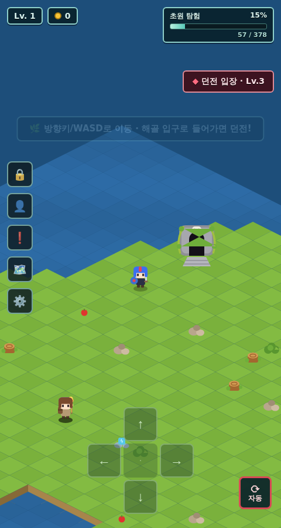
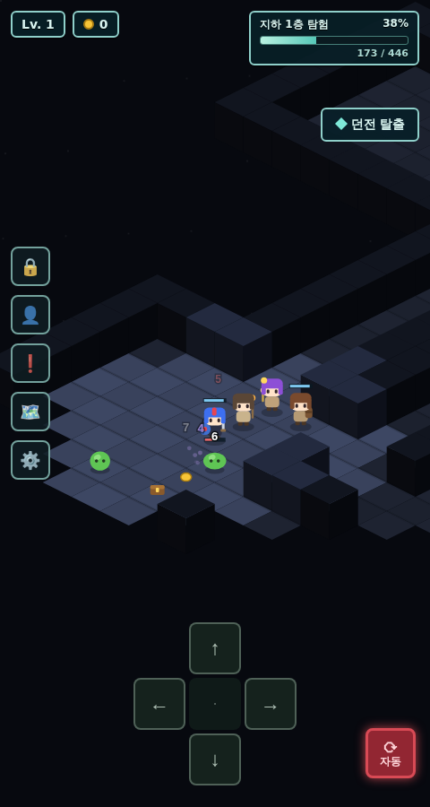
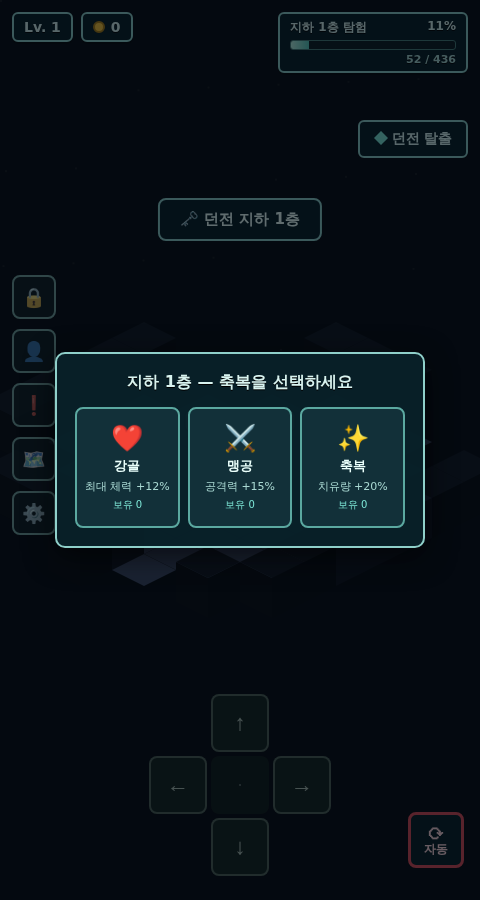

# 던전 (DunJeon) 🏰

귀여운 쿼터뷰(아이소메트릭) **로그라이트 파티 던전 크롤러**입니다.
초원을 탐험하다 해골 입구로 들어가면 절차 생성 던전이 펼쳐지고, 죽어도 골드와 경험은 남아 점점 강해집니다.

**▶ 플레이: https://jh4334.github.io/dunjeon/** (main 브랜치 push 시 GitHub Pages로 자동 배포)

  

## 로그라이트 루프

1. **던전 입장** → 런 시작, 층마다 새로 생성되는 맵. **바이옴 4종**이 각자 다른 생성 알고리즘으로 만들어집니다
   - ⚰️ 낡은 지하묘지(방+복도) / 🕳️ 천연 동굴(셀룰러 오토마타) / 💧 물에 잠긴 수로(운하+다리) / 🔥 작열의 심층(용암 강+외길 다리)
   - 바이옴마다 몬스터 분포와 장식이 다릅니다 (동굴=박쥐↑, 수로=슬라임↑, 심층=해골↑)
2. **계단을 밟으면 갈림길** — 다음 층을 2개 중에서 고릅니다 (보스 층은 갈림길 없이 고정 진입)
   - 🛡️ 안전한 경로 / 💀 위험한 경로(엘리트 2배·팩 +1, 대신 골드·XP ×1.4)
   - 약 25% 확률로 특수 층: 💰 **보물방**(몬스터 0, 보물 다수 + 함정 촘촘) / ⚔️ **도전방**(3웨이브 아레나, 클리어 시 유물)
   - 일반 층 20% 확률로 🛒 **떠돌이 상인** 등장 — 골드로 유물·포션 구매
3. **층마다 축복 선택** (런 한정 버프): 맹공 ⚔️ / 강골 ❤️ / 축복 ✨ / 탐욕 💰 / 급소 노리기 🎯 / 철벽 🛡️
4. **3층마다 보스** (슬라임 킹 → 리치) — 보스를 잡아야 계단이 열리고, 처치 시 **유물 3택1**
   - 유물: 흡혈 송곳니 🗡️ / 가시 갑옷 🌵 / 신속의 장화 👢 / 황금 부적 🧿 / 마나 수정 🔮 / 불사조 깃털 🪶(전멸 1회 무효)
5. **엘리트 몬스터**(보라 오라)와 **가시 함정**, 회복 **포션**이 층마다 등장
6. **전멸하면** 축복·유물은 사라지고 골드 10%를 잃지만, 경험치·레벨·골드는 유지
7. **초원의 ⚒️ 캠프에서 골드로 영구 강화** → 다음 런이 더 수월해짐 (최고 도달 층 🏆 기록)

## 실행 방법

빌드 과정 없이 순수 HTML/CSS/JS(Canvas)로 만들어져 있습니다.

```bash
# 방법 1: 브라우저에서 index.html을 바로 열기
# 방법 2: 간단한 로컬 서버
python3 -m http.server 8000
# → http://localhost:8000
```

모바일 브라우저에서도 화면 하단 D-패드로 조작할 수 있습니다.

## 조작법

| 조작 | 설명 |
|---|---|
| 방향키 / WASD / D-패드 | **화면 기준 8방향 이동** (↑를 누르면 화면 위로) — 파티원들이 줄지어 따라옵니다 |
| `자동` 버튼 | 자동 탐험 (미탐험 지역 → 보스/계단/입구 순으로 알아서 이동·전투) |
| `던전 탈출` 버튼 | 런 종료 — 획득한 골드를 챙겨 귀환 |
| `강화` 버튼 (초원) | 모닥불 캠프 — 골드로 영구 강화 |
| 🗺️ 버튼 | 미니맵 토글 |

## 게임 요소

- **파티**: 기사 유리(리더, 근접), 마법사 모리(원거리), 사제 리라(치유·부활), 짐꾼 토토(골드 보너스)
- **초원**: 절차 생성 섬, 장식물, 던전 입구, 탐험률 게이지, 모닥불 캠프(영구 강화)
- **던전**: 바이옴 4종(지하묘지·동굴·수로·심층)별 생성 알고리즘, 갈림길 선택, 특수 층(보물방·도전방·상인), 시야(fog of war), 치유/저주의 샘, 3층마다 보스
- **전투**: 실시간 자동 전투 — 슬라임 / 박쥐 / 스켈레톤 / 보스(슬라임 킹·리치), 치명타, 데미지 플로터, HP 바
- **성장**: 런 한정 축복(층마다 선택) + 영구 강화(캠프) + 레벨업, 골드·보물상자
- **정산**: 탈출/전멸 시 런 결과(도달 층·처치 수·획득 골드) 요약
- **연출**: 파티원 잡담 말풍선, 반짝임 이펙트
- **저장**: 레벨/경험치/골드/영구 강화는 localStorage에 자동 저장

## 배포

`.github/workflows/deploy.yml` — main 브랜치에 push되면 GitHub Actions가 정적 파일을 GitHub Pages로 배포합니다. (첫 배포 시 워크플로가 Pages를 자동 활성화)

## 구조

```
index.html   # 마크업 + HUD
style.css    # HUD 스타일
game.js      # 게임 전체 (맵 생성 / 이동 / 전투 / 자동탐험 / 렌더링)
```
